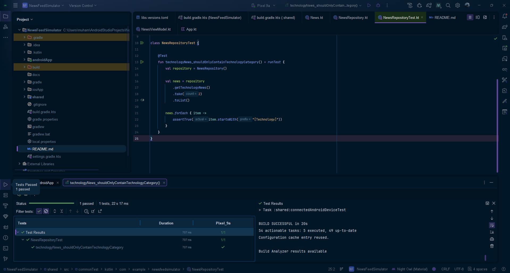

# News Feed Simulator

## Deskripsi

News Feed Simulator adalah aplikasi sederhana berbasis Kotlin Multiplatform yang dibuat untuk menerapkan materi Advanced Kotlin, Coroutines, dan Flow.

Aplikasi ini mensimulasikan aliran berita yang muncul secara berkala. Berita kemudian difilter berdasarkan kategori, diubah format tampilannya, dan ditampilkan pada aplikasi.

Selain itu, aplikasi menggunakan StateFlow untuk menyimpan jumlah berita yang telah dibaca dan Coroutines untuk mengambil detail beberapa berita secara asynchronous.

---

## Fitur

- Menampilkan berita secara berkala menggunakan Kotlin Flow
- Memfilter berita berdasarkan kategori Technology
- Mengubah format berita menggunakan operator `map`
- Menampilkan jumlah berita yang sudah dibaca menggunakan StateFlow
- Mengambil detail beberapa berita secara asynchronous menggunakan Coroutines
- Menangani error pada Flow menggunakan `catch`
- Unit test untuk memeriksa filter kategori berita

---

## Teknologi

- Kotlin
- Kotlin Multiplatform
- Compose Multiplatform
- Kotlin Coroutines
- Kotlin Flow
- StateFlow
- Android Studio

---

# Implementasi

## 1. Data Class

Data berita disimpan menggunakan `data class` bernama `News`.

```kotlin
data class News(
    val id: Int,
    val title: String,
    val category: String,
    val summary: String
)
```

Data class digunakan untuk merepresentasikan informasi sebuah berita seperti ID, judul, kategori, dan ringkasan.

---

## 2. Kotlin Flow

Berita dibuat menggunakan `Flow`. Flow digunakan karena aplikasi perlu menghasilkan beberapa berita secara bertahap.

```kotlin
fun getNews(): Flow<News> = flow {
    while (true) {
        for (news in newsList) {
            emit(news)
            delay(2000)
        }
    }
}
```

`emit()` digunakan untuk mengirim berita ke dalam Flow, sedangkan `delay(2000)` memberikan jeda 2 detik sebelum berita berikutnya dikirim.

Flow bersifat cold, sehingga proses di dalam Flow mulai berjalan ketika Flow dikumpulkan menggunakan `collect`.

Alur sederhananya:

```text
News List
   ↓
Flow
   ↓
emit()
   ↓
Berita dikirim setiap 2 detik
   ↓
collect()
   ↓
UI menerima berita
```

---

## 3. Flow Operators

Flow menggunakan beberapa operator untuk mengolah data berita.

### Filter

`filter` digunakan untuk memilih berita berdasarkan kategori.

```kotlin
.filter { news ->
    news.category == "Technology"
}
```

Operator ini hanya meneruskan berita yang memiliki kategori `Technology`.

Contohnya:

```text
News 1 - Technology  → diteruskan
News 2 - Sports      → tidak diteruskan
News 3 - Technology  → diteruskan
News 4 - Health      → tidak diteruskan
```

### Map

`map` digunakan untuk mengubah objek `News` menjadi `String` yang siap ditampilkan.

```kotlin
.map { news ->
    "[${news.category}] ${news.title}"
}
```

Dengan demikian:

```text
News
  ↓
filter
  ↓
Berita Technology
  ↓
map
  ↓
String untuk ditampilkan
```

Contoh hasil:

```text
[Technology] AI Mengubah Dunia Pendidikan
```

### Catch

`catch` digunakan untuk menangani error yang terjadi pada Flow.

```kotlin
.catch { error ->
    println("Terjadi error: ${error.message}")
}
```

Dengan `catch`, error pada proses Flow dapat ditangani tanpa langsung menghentikan seluruh proses aplikasi.

---

## 4. StateFlow

StateFlow digunakan untuk menyimpan state jumlah berita yang sudah dibaca.

```kotlin
private val _readNewsCount = MutableStateFlow(0)

val readNewsCount: StateFlow<Int> = _readNewsCount
```

`MutableStateFlow` digunakan sebagai state yang dapat diubah dari dalam ViewModel.

Sedangkan `StateFlow` diberikan kepada UI agar UI hanya dapat membaca state tersebut.

Ketika pengguna menekan tombol `Mark as Read`:

```kotlin
fun markAsRead() {
    _readNewsCount.value += 1
}
```

Nilai counter akan bertambah dan UI akan mendapatkan nilai terbaru.

Alurnya:

```text
User menekan "Mark as Read"
          ↓
markAsRead()
          ↓
_readNewsCount bertambah
          ↓
StateFlow mengirim state terbaru
          ↓
UI diperbarui
```

---

## 5. Coroutines

Coroutines digunakan untuk menjalankan pekerjaan asynchronous tanpa harus membuat dan mengatur thread secara manual.

Pada aplikasi ini, coroutine digunakan untuk mengambil detail beberapa berita.

```kotlin
val details = newsIds.map { newsId ->
    async {
        repository.fetchNewsDetail(newsId)
    }
}.awaitAll()
```

`async` digunakan untuk menjalankan proses asynchronous dan menghasilkan `Deferred`.

`awaitAll()` digunakan untuk menunggu seluruh proses asynchronous selesai dan mendapatkan semua hasilnya.

Alurnya:

```text
News ID 1 ──→ async ──→ Detail 1
News ID 2 ──→ async ──→ Detail 2
News ID 3 ──→ async ──→ Detail 3
                         ↓
                      awaitAll()
                         ↓
                  Semua detail tersedia
```

---

## 6. Suspend Function

Pengambilan detail berita menggunakan `suspend` function.

```kotlin
suspend fun fetchNewsDetail(newsId: Int): String {
    delay(1000)
    return "Detail berita dengan ID $newsId"
}
```

`suspend` memungkinkan fungsi ditangguhkan sementara ketika sedang menunggu proses seperti `delay()`.

Fungsi tersebut dapat dipanggil dari dalam coroutine.

---

# Alur Keseluruhan Aplikasi

Secara keseluruhan, alur aplikasi adalah:

```text
                    NewsRepository
                          │
                          ▼
                    getNews()
                          │
                          ▼
                     Kotlin Flow
                          │
                    ┌─────┴─────┐
                    ▼           ▼
                 filter        map
                    │           │
                    └─────┬─────┘
                          ▼
                   Technology News
                          │
                          ▼
                     ViewModel
                          │
                          ▼
                          UI


User ──→ Mark as Read
              │
              ▼
        MutableStateFlow
              │
              ▼
        Read News Count
              │
              ▼
              UI


User ──→ Fetch News Details
              │
              ▼
        Coroutine launch
              │
              ▼
       async + async + async
              │
              ▼
          awaitAll()
              │
              ▼
        News Details
              │
              ▼
              UI
```

---

# Struktur Project

```text
NewsFeedSimulator/
├── androidApp/
├── iosApp/
├── shared/
│   └── src/
│       ├── commonMain/
│       │   └── kotlin/
│       │       └── com/example/newsfeedsimulator/
│       │           ├── data/
│       │           │   └── News.kt
│       │           ├── repository/
│       │           │   └── NewsRepository.kt
│       │           ├── viewmodel/
│       │           │   └── NewsViewModel.kt
│       │           └── App.kt
│       │
│       └── commonTest/
│           └── kotlin/
│               └── com/example/newsfeedsimulator/
│                   └── NewsRepositoryTest.kt
│
├── docs/
│   └── test-result.png
│
├── gradle/
├── README.md
├── build.gradle.kts
└── settings.gradle.kts
```

---

# Unit Test

Project memiliki unit test untuk memastikan bahwa `getTechnologyNews()` hanya menghasilkan berita dengan kategori `Technology`.

Test yang digunakan:

```kotlin
@Test
fun technologyNews_shouldOnlyContainTechnologyCategory() = runTest {
    val repository = NewsRepository()

    val news = repository
        .getTechnologyNews()
        .take(2)
        .toList()

    news.forEach { item ->
        assertTrue(item.startsWith("[Technology]"))
    }
}
```

Test menggunakan `take(2)` untuk mengambil dua hasil dari Flow.

Kemudian setiap hasil diperiksa menggunakan `assertTrue()` untuk memastikan hasil tersebut diawali dengan:

```text
[Technology]
```

## Hasil Test

Test berhasil dijalankan menggunakan Android Emulator.

**Hasil: 1 test passed**



Screenshot di atas merupakan bukti hasil pengujian `NewsRepositoryTest`.

---

# Cara Menjalankan

1. Buka project menggunakan Android Studio.
2. Tunggu proses Gradle Sync selesai.
3. Jalankan emulator Android.
4. Jalankan aplikasi melalui konfigurasi `androidApp`.
5. Untuk menjalankan unit test, buka `NewsRepositoryTest.kt`.
6. Jalankan test `technologyNews_shouldOnlyContainTechnologyCategory`.

---

# Hasil Implementasi

Aplikasi berhasil menerapkan:

- Kotlin Flow untuk menghasilkan berita secara berkala
- `filter` untuk menyaring berita berdasarkan kategori
- `map` untuk mengubah format berita
- `collect` untuk mengambil data dari Flow
- StateFlow untuk menyimpan jumlah berita yang dibaca
- Coroutines dengan `launch`
- `async` dan `awaitAll()` untuk mengambil detail berita
- `suspend` function untuk proses yang dapat ditangguhkan
- `catch` untuk error handling
- Unit test untuk memeriksa hasil filter

---

# Tujuan Pembelajaran

Project ini dibuat untuk menerapkan materi Advanced Kotlin, Coroutines, dan Flow dalam aplikasi Kotlin Multiplatform.

Konsep yang diterapkan meliputi:

- Data Class
- Flow
- Flow Operators
- `filter`
- `map`
- `collect`
- StateFlow
- MutableStateFlow
- Coroutines
- `launch`
- `async`
- `awaitAll`
- `suspend`
- Error Handling
- Unit Testing